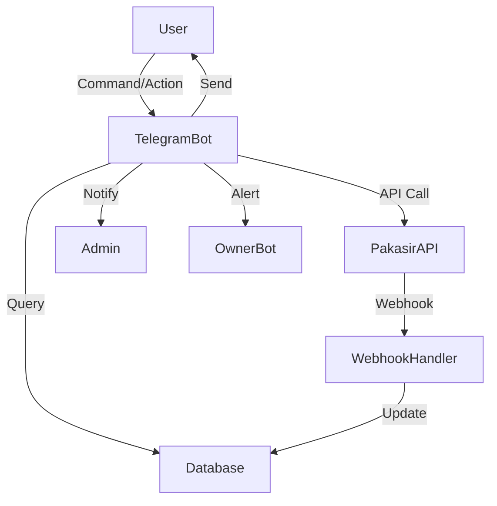

# Architecture Plan – Bot Auto Order Telegram

## System Overview

Bot Auto Order Telegram adalah sistem otomatisasi pemesanan produk digital melalui Telegram, terintegrasi dengan payment gateway Pakasir. Sistem ini dirancang modular, scalable, dan aman, dengan observability dan audit log yang lengkap.

> **Update 6 Nov 2025:** PaymentService menambahkan modul fee kalkulasi & deposit service baru, scheduler `check_expired_payments_job` menangani pembersihan invoice + notifikasi deposit, dan layer bot memastikan welcome/keranjang mengikuti aturan UX terbaru.

---

## Business Process

1. **User** mengirim perintah ke bot Telegram (`/start`, pilih produk, dsb).
2. **Bot** menampilkan produk, detail, dan keranjang belanja.
3. **User** memilih produk, menambah ke keranjang, dan lanjut ke pembayaran.
4. **Bot** mengintegrasikan pembayaran via Pakasir (QRIS, saldo, dsb).
5. **Bot** memproses webhook dari Pakasir untuk update status order.
6. **Bot** mengirim SNK (Syarat & Ketentuan) ke user setelah pembayaran sukses.
7. **User** mengirim bukti SNK, diteruskan ke admin/seller.
8. **Admin** mengelola produk, order, user, dan broadcast melalui menu Telegram.
9. **Owner** menerima notifikasi monitoring, error, dan alert via bot owner khusus.

---

## Modules

| Modul                | Fungsi Utama                                                                 |
|----------------------|------------------------------------------------------------------------------|
| bot_handler          | Menangani command dan interaksi user di Telegram                             |
| admin_handler        | Menu admin untuk CRUD produk, order, user, template pesan, backup/restore    |
| payment_integration  | Integrasi API Pakasir, invoice, webhook, validasi pembayaran                 |
| snk_handler          | Pengelolaan SNK per produk, pengiriman otomatis, dan pencatatan submission   |
| broadcast_handler    | Fitur broadcast pesan admin ke seluruh user                                  |
| logging              | Logging interaksi, error, audit perubahan, dan metrik                        |
| monitoring           | Health check, alert error, resource monitoring ke bot owner khusus           |
| config_manager       | Manajemen konfigurasi, backup/restore, validasi placeholder                  |
| anti_spam            | Rate limit, deteksi spam, dan notifikasi ke admin                            |
| database             | ORM/data access layer untuk semua entitas                                    |

---

## Data Flow



### Penjelasan Data Flow

- User berinteraksi dengan bot Telegram.
- Bot mengambil data produk, order, dsb dari database.
- Untuk pembayaran, bot memanggil API Pakasir dan menunggu webhook.
- Webhook handler memperbarui status order di database.
- Bot mengirim notifikasi ke user, admin, dan owner sesuai event.
- Semua perubahan dan error dicatat di modul logging.

---

## Database Schema (Simplified)

### Tabel Utama

- **users**
  - id (PK)
  - telegram_id (unique)
  - username
  - role (buyer/admin/owner)
  - created_at

- **products**
  - id (PK)
  - name
  - category_id (FK)
  - price
  - stock
  - description
  - snk_text
  - image_url
  - created_at

- **categories**
  - id (PK)
  - name
  - emoji
  - created_at

- **orders**
  - id (PK)
  - user_id (FK)
  - product_id (FK)
  - quantity
  - total_price
  - status (pending/paid/completed/cancelled/expired)
  - payment_method
  - order_id (unique, format: tg{telegram_id}-{timestamp/random})
  - created_at
  - updated_at

- **snk_submissions**
  - id (PK)
  - order_id (FK)
  - user_id (FK)
  - snk_text
  - snk_image_url
  - submitted_at

- **admin_logs**
  - id (PK)
  - admin_id (FK)
  - action
  - target_type (product/order/user/config)
  - target_id
  - detail
  - timestamp

- **broadcasts**
  - id (PK)
  - admin_id (FK)
  - message
  - image_url
  - sent_at

- **config**
  - key (PK)
  - value
  - updated_at

- **audit_logs**
  - id (PK)
  - event_type
  - detail
  - timestamp

### Contoh DDL

```sql
CREATE TABLE users (
  id SERIAL PRIMARY KEY,
  telegram_id BIGINT UNIQUE NOT NULL,
  username VARCHAR(64),
  role VARCHAR(16) DEFAULT 'buyer',
  created_at TIMESTAMP DEFAULT CURRENT_TIMESTAMP
);

CREATE TABLE products (
  id SERIAL PRIMARY KEY,
  name VARCHAR(128) NOT NULL,
  category_id INTEGER REFERENCES categories(id),
  price NUMERIC(12,2) NOT NULL,
  stock INTEGER DEFAULT 0,
  description TEXT,
  snk_text TEXT,
  image_url TEXT,
  created_at TIMESTAMP DEFAULT CURRENT_TIMESTAMP
);

CREATE TABLE orders (
  id SERIAL PRIMARY KEY,
  user_id INTEGER REFERENCES users(id),
  product_id INTEGER REFERENCES products(id),
  quantity INTEGER NOT NULL,
  total_price NUMERIC(12,2) NOT NULL,
  status VARCHAR(16) NOT NULL,
  payment_method VARCHAR(32),
  order_id VARCHAR(64) UNIQUE NOT NULL,
  created_at TIMESTAMP DEFAULT CURRENT_TIMESTAMP,
  updated_at TIMESTAMP DEFAULT CURRENT_TIMESTAMP
);

CREATE TABLE snk_submissions (
  id SERIAL PRIMARY KEY,
  order_id INTEGER REFERENCES orders(id),
  user_id INTEGER REFERENCES users(id),
  snk_text TEXT,
  snk_image_url TEXT,
  submitted_at TIMESTAMP DEFAULT CURRENT_TIMESTAMP
);

CREATE TABLE admin_logs (
  id SERIAL PRIMARY KEY,
  admin_id INTEGER REFERENCES users(id),
  action VARCHAR(64),
  target_type VARCHAR(32),
  target_id INTEGER,
  detail TEXT,
  timestamp TIMESTAMP DEFAULT CURRENT_TIMESTAMP
);

CREATE TABLE broadcasts (
  id SERIAL PRIMARY KEY,
  admin_id INTEGER REFERENCES users(id),
  message TEXT,
  image_url TEXT,
  sent_at TIMESTAMP DEFAULT CURRENT_TIMESTAMP
);

CREATE TABLE config (
  key VARCHAR(64) PRIMARY KEY,
  value TEXT,
  updated_at TIMESTAMP DEFAULT CURRENT_TIMESTAMP
);

CREATE TABLE audit_logs (
  id SERIAL PRIMARY KEY,
  event_type VARCHAR(32),
  detail TEXT,
  timestamp TIMESTAMP DEFAULT CURRENT_TIMESTAMP
);
```

---

## Security Considerations

- **Authentication & Authorization**
  - Admin dan owner diidentifikasi via Telegram ID.
  - Owner memiliki akses penuh audit dan monitoring.
  - Seller/admin tidak memiliki akses ke server/codebase.

- **Input Validation**
  - Semua input dari user/admin divalidasi sebelum diproses.
  - Validasi placeholder pada template pesan admin.

- **Secrets & Credentials**
  - Semua API key/token disimpan di file `.env` dan masuk `.gitignore`.
  - Tidak ada credential yang di-commit ke repo.

- **Rate Limiting & Anti-Spam**
  - Rate limit aksi user (min 1 detik per aksi).
  - Deteksi spam dan notifikasi ke admin.

- **Logging & Audit**
  - Semua interaksi, error, dan perubahan konfigurasi dicatat di `/logs/`.
  - Format log: `[timestamp] [level] message`.
  - Audit log untuk perubahan penting dan fraud detection.

- **Backup & Restore**
  - Backup database, konfigurasi, dan log secara otomatis dan offsite.
  - Monitoring integritas backup dan alert ke owner.

- **Monitoring & Alerting**
  - Health check, error, dan resource monitoring dikirim ke bot owner khusus notifikasi.
  - Setiap alert menyertakan info `bot_store_name` untuk identifikasi bot bermasalah.

- **Webhook Security**
  - Validasi signature pada webhook Pakasir jika tersedia.
  - Idempotensi pada pemrosesan webhook (cek order_id).

- **Privacy**
  - Data pribadi user/admin dijaga privasinya.
  - Hanya admin/owner yang berwenang dapat mengakses data sensitif.

---

## Folder Structure

```
bot-auto-order/
┣ docs/
┣ src/
┃ ┣ bot/
┃ ┣ bot/admin/
┃ ┣ core/
┃ ┣ services/
┃ ┣ utils/
┣ logs/
┣ tests/
┣ requirements.txt
┣ .env (tidak di-commit)
┣ .gitignore
```

---

## Dependencies

- **Python 3.12+**
- **python-telegram-bot** (versi stabil terbaru)
- **httpx** atau **aiohttp** (API Pakasir)
- **qrcode** (opsional, untuk QR lokal)
- **logging** (bawaan Python)
- **psycopg2** atau **asyncpg** (PostgreSQL)
- **pytest** (testing)

---

## Extensibility & Scalability

- Modular: mudah menambah fitur baru (misal, metode pembayaran lain, integrasi marketplace).
- Scalable: mendukung multi-bot dalam satu VPS, identifikasi via `bot_store_name`.
- Observability: audit log, metrik, dan monitoring terpusat.

---

## Diagram Arsitektur (Placeholder)


---

> Dokumen ini wajib diupdate setiap ada perubahan besar pada arsitektur, modul, atau flow data.
> Semua pengembangan dan audit harus mengacu pada arsitektur dan protokol di dokumen ini.
